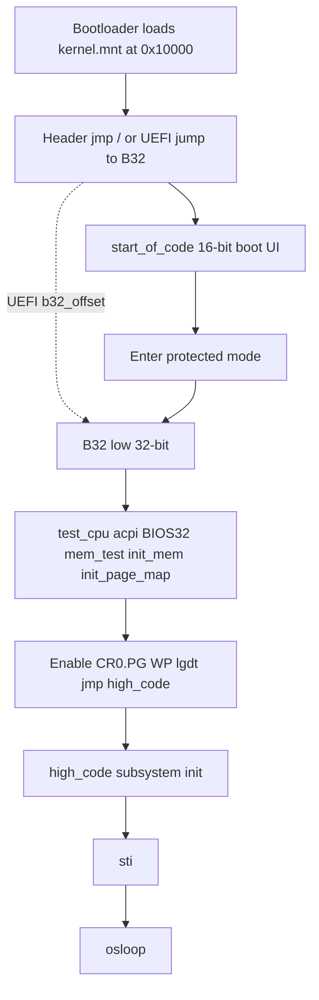

# Boot Sequence

Derived from local sources; early memory init from upstream `init.inc` mirror.

## Overview

## Stage 0 — Loader

**LOCAL FACT** ([`kernel/docs/loader_doc.txt`](../../kernel/docs/loader_doc.txt)):

- Place kernel image so linked `KERNEL_BASE` matches.
- Optional handshake: `AX='KL'`, `/sys` via `CX/DX/BX`.
- Provide ramdisk / boot_data as required by path.

Loaders in tree: `bootloader/boot_fat12.asm`, `grub4kos.asm`, `uefi4kos/*`, `extended_primary_loader/*`, `sec_loader/*`.

## Stage 1 — 16-bit (`bootbios.inc` / `boot/bootcode.inc`)

**LOCAL FACT:**

1. Header: `jmp start_of_code`, signature `'KolibriOS '`, version, `b32_offset`.
2. Boot UI: language, VESA mode selection, config.
3. E820 memory map (`detect/biosmem.inc`) into `BOOT_LO`.
4. Disk / ramdisk load paths.
5. A20, mask PICs, `lgdt` temporary GDT, set `CR0_PE`, `jmp pword os_code:B32`.

## Stage 2 — `B32` pre-paging (`kernel.asm`)

**LOCAL FACT:**

1. Load `os_stack` segments; `esp = TMP_STACK_TOP`.
2. Clear `CLEAN_ZONE` through heap; clear uglobals; scrub low memory regions.
3. `call test_cpu` then force `CAPS_TSC`.
4. `call acpi_locate`, `init_BIOS32`.
5. `call mem_test`, `init_mem`, `init_page_map` (**UPSTREAM FACT** bodies).
6. `cr3 = sys_proc - OS_BASE + PROC.pdt_0`.
7. `cr0 |= CR0_PG|CR0_WP`; `lgdt [gdts]`; `jmp os_code:high_code`.

## Stage 3 — `high_code` (condensed)

**LOCAL FACT** — order in `kernel.asm` until `sti` / `osloop` (see detailed table from analysis):

1. Segment reload; `esp += OS_BASE`.
2. PAT/PGE PTE masks; TLB flush.
3. Init core mutexes.
4. APM GDT fixup; copy BOOT flags into globals.
5. SYSENTER / SYSCALL MSR setup.
6. Map TSS pages; `build_interrupt_table` + `lidt`.
7. `init_kernel_heap`, `init_fpu`, allocate OS ring0 stack, fill TSS, `ltr`.
8. Init `sys_proc` lists; `init_video`, MTRR/PAT, framebuffer, `init_malloc`.
9. Carve IPC/helper mappings; `init_events`; service list; display win_map; clipboard.
10. ACPI/HPET optional.
11. Create IDLE + OS slots; optional AP startup.
12. `init_irqs`, `PIC_init`, `init_sys_v86`, `PIT_init`, ramdisk, `APIC_init`, unmask timer/IRQ2/13.
13. PCI enum, ATA, AHCI, video PE driver, `usb_init`.
14. Window/background defaults; display; CPU freq; `set_variables`.
15. **`stack_init`** (network).
16. FDC; skin; I/O maps; PS/2 keyboard + mouse PE driver.
17. Optional launch first app from `/sys`.
18. Enable timer ticks; **`sti`**; `mtrr_validate`; **`jmp osloop`**.

## Stage 4 — Runtime loop

**LOCAL FACT:** `osloop` / `Wait_events` processes window/mouse/misc, `stack_handler`, timers, device maintenance.

## Initialization dependencies

```mermaid
flowchart LR
  cpu[test_cpu] --> mem[mem_test init_mem init_page_map]
  mem --> paging[Enable paging]
  paging --> idt[IDT TSS]
  idt --> heap[kernel heap malloc]
  heap --> slots[IDLE OS threads]
  slots --> irq[PIC PIT APIC IRQs]
  irq --> pci[PCI ATA AHCI USB]
  pci --> gui[video GUI input]
  gui --> net[stack_init]
  net --> apps[first app]
  apps --> stiNode[sti osloop]
```

## Local defect impact

Without a real `init.inc`, Stage 2 symbols are undefined. Reconstruction: [`../_meta/upstream-init-diff.md`](../_meta/upstream-init-diff.md).
