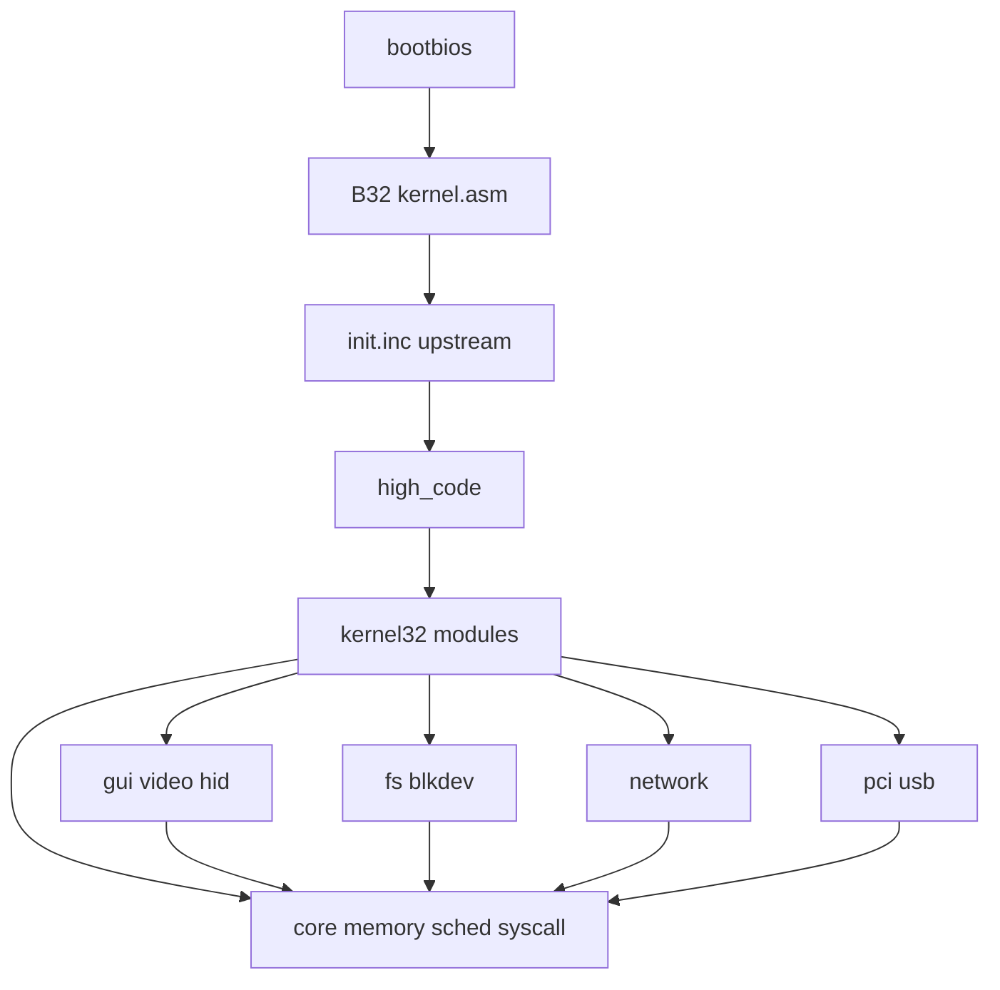

# Dependency Graphs

## Module dependencies (include / call)



## Data dependencies

```text
boot_data → pg_data/MEM_AMOUNT → PROC.pdt → APPDATA → WDATA
SRV → PE image → calls exports → memory/events/disk
DISK → PARTITION → FileSystem
NET_DEVICE → SOCKET
```

## Control-flow (runtime)

```text
irq0 → find_next_task → do_change_task
int0x40 → servetable2 → subsystem
osloop → window/mouse/stack_handler/timers
USB IRQ → wake usb thread → ProcessDeferred
driver IOCTL → srv_proc
```

## ABI dependencies

```text
Bootloader → boot_data/header
Apps → syscalls/events/FS/GUI
Drivers → KERNEL exports + Disk/USB/Net regs
```

## Initialization dependencies

See [`boot-sequence.md`](boot-sequence.md). Critical chain: CPU → memory/paging → IDT/TSS → heap → threads → IRQ/timer → PCI/storage/USB → GUI → net → apps → sti.

## Circular dependencies (explicit)

| Cycle | Nature |
|-------|--------|
| `APPDATA` ↔ `WDATA` | Pointer cycle |
| Scheduler ↔ blocked sync | wait → change_task → run waiter |
| GUI ↔ events ↔ input | mutual callbacks via osloop |
| FS execute ↔ taskman ↔ memory | create process while holding FS context |
| Drivers ↔ kernel exports ↔ drivers | service graph |

## Rust cut implication

Break cycles at **compatibility boundaries** (syscall, export, boot), not by preserving FASM include cycles.
