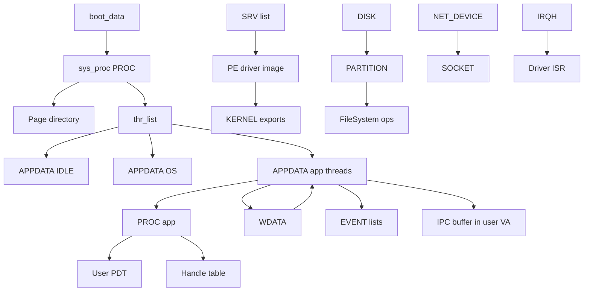

# Object Relationships

## Primary relationships

| From | To | How | Cycle? |
|------|----|-----|--------|
| `APPDATA` | `PROC` | `process` ptr | Threads share process |
| `PROC` | `APPDATA` | `thr_list` | |
| `APPDATA` | `WDATA` | `window` | **Yes** with back-ptr |
| `WDATA` | `APPDATA` | `thread` | **Yes** |
| `APPDATA` | `EVENT`/`APPOBJ` | `fd_ev`/`bk_ev` lists | |
| `APPDATA` | user IPC mem | `ipc_start`/`ipc_size` | |
| `SRV` | driver code | `base`/`entry`/`srv_proc` | |
| `DISK` | FS | partition + `FileSystem` | |
| `PROC` | page frames | PDT PTEs | |
| Socket | `NET_DEVICE` | binding | |

## Scheduler rings

Independent of `PROC.thr_list`: `APPDATA.in_schedule` threads each priority ring (`scheduler_current[]`).

## Handle table

`PROC.htab` maps integer handles to kernel objects (files, pipes, futexes, …) for POSIX syscall 77 and related paths.

## Implications for Rust

- Preserve **edge semantics** visible to apps (PID/TID, windows, events) even if pointer fields become handles internally.
- Compatibility layer may keep C-like `APPDATA`/`WDATA` shims at fixed VAs during migration.
- Break cycles with ownership types: e.g. `Window` owned by `Thread`, weak back-ref.
