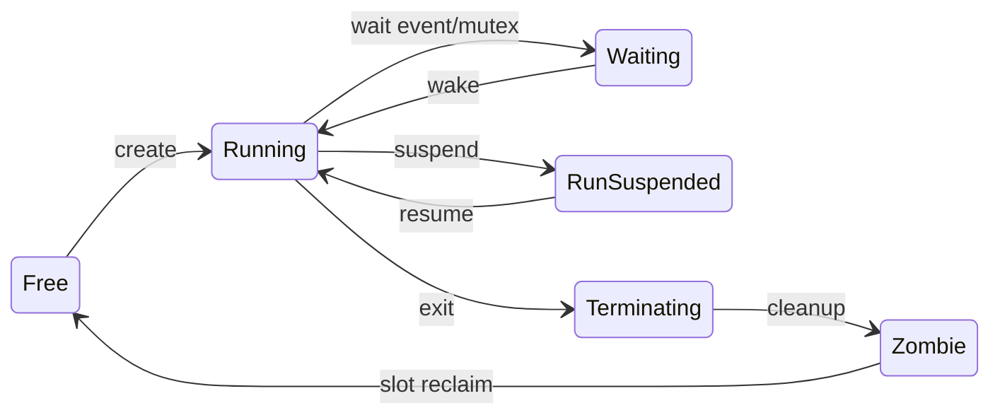

# Scheduler

## Algorithm

**LOCAL FACT** — [`kernel/core/sched.inc`](../../kernel/core/sched.inc):

- Three FIFO rings (`NR_SCHED_QUEUES=3`).
- Always prefer highest non-empty ring with a runnable thread.
- Optional local priority quanta via `def_priority` / `cur_priority` on `APPDATA`.
- Accounting via TSC (`update_counters` / `updatecputimes`).

## Preemption points

1. PIT/APIC timer → `irq0`
2. Device IRQ exit (higher priority only)
3. Voluntary `change_task` (mutex wait, `osloop`, sleeps)

**Not** every syscall.

## Locking

**LOCAL FACT:** `SchedulerLock` is **not** a spinlock. Macros:

```asm
spin_lock_irqsave    → pushf / cli
spin_unlock_irqrestore → popf
```

Uniprocessor assumption.

## Key APIs

| Symbol | Role |
|--------|------|
| `scheduler_add_thread` | Insert into ring |
| `scheduler_remove_thread` | Remove |
| `find_next_task` | Select next |
| `do_change_task` | Switch |
| `change_task` | Yield |
| `delay_hs` / `delay_ms` | Sleep helpers (exported `Delay`/`Sleep`) |
| `timer_hs` / `cancel_timer_hs` | Timed callbacks (drivers) |

## Invariants (INFERENCE marked)

1. `current_slot` always points at a live `APPDATA` while multitasking runs.
2. Exactly one thread executes on BSP (UP model).
3. Ring lists are circular `LHEAD`s; empty ring skipped.
4. Waiting threads leave runnable set until wait predicate passes.

## State machine (thread)



## Compatibility note

Exact quanta and IRQ preemption timing are **BEHAVIORAL ABI** for some apps/drivers (timing-sensitive). Rust may change internals but must not break observable fairness enough to fail apps — validate with tests.
