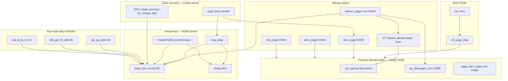

# Stage-4 Ownership Design (Physical Allocator)

**Date:** 2026-08-13 (research); Cut CT 2026-08-14; Slice E / Cut CU 2026-08-14  
**Status:** **Slice E / Cut CU COMPLETE** — Rust sole runtime owner of
`sys_pgmap` / `pages_free` / `page_start`; PTE/`map_page`/fault/CR3/mutex/`invlpg`
and `release_pages` orchestration remain FASM  
**Implementation:** [`cut-cu-implementation.md`](cut-cu-implementation.md)  
**Cut plan:** [`cut-cu-plan.md`](cut-cu-plan.md) /
  [`stage4-bitmap-ownership-cut-plan.md`](stage4-bitmap-ownership-cut-plan.md)  
**Post-CT audit (historical):** [`stage4-next-ownership-audit.md`](stage4-next-ownership-audit.md)  
**Parent blocked state:** [`cut-cs-plan.md`](cut-cs-plan.md) (historical)  
**Inventory after CU:** **103 / 138**  
**Live A/B:** [`stage4-release-pages-ab.md`](stage4-release-pages-ab.md)
  (**RELEASE/FREE PAGE_START DIFFERENCE PROVEN** — revalidated under Slice E ON)  
**Call-out ABI:** §19 /
  [`stage4-release-bitmap-contract.md`](stage4-release-bitmap-contract.md) /
  Mode B under Cut CU  
**Evidence policy:** [`../_meta/evidence-policy.md`](../_meta/evidence-policy.md)

> Cut CU / Slice E transferred sole **runtime** ownership of the physical
> bitmap allocator state to Rust. This is **not** general paging ownership:
> `release_pages` remains FASM orchestration; PTE/CR3/fault/mutex/`invlpg` stay FASM.

---

## 1. Verified baseline (post–Cut CU / Slice E)

| Item | Value |
|------|-------|
| Inventory | **103 / 138** (post–Cut CU) |
| Production gates | **104** enabled (`[[rust.migrations]]`) |
| Cut CS | **BLOCKED** (historical) |
| Cut CT | **COMPLETE** — Mode A leaf; superseded for `pages_free` by Mode B when CU ON |
| Cut CU / Slice E | **COMPLETE** — [`cut-cu-implementation.md`](cut-cu-implementation.md) |
| `TMP_STACK_TOP` / `sys_proc` / `SLOT_BASE` | **`0x8E000` / `0x8E000` / `0x90000`** (REG-012) |
| Cut CU ON end `.bss` | `OS_BASE+0x8C7C3` (assert `0x8D7C3 < 0x8E000` PASS) |
| Combined Slice E blobs | **546 B**, 0 relocs |

Path A is **accepted for Slice E** as one coherent multi-symbol ownership cut
(not four Path B leaves). Opportunistic leaf bundling remains rejected.

---

## 2. Current ownership model (LOCAL FACT)

### 2.1 Physical page bitmap (allocator core)

| Object | Location | Owner today | R/W |
|--------|----------|-------------|-----|
| `sys_pgmap` | `data32.inc` — `rb 1024*1024/8` (128 KiB; bit/page for first 4 GiB) | **FASM** | W: `alloc_page`, `alloc_pages`, `free_page`, `release_pages`, boot `init_page_map` |
| `pg_data.pages_free` | `struct PG_DATA` (`const.inc`) | **FASM** | W: same writers; R: many (sysfn 16, taskman, disk_cache, Cut O smoke, …) |
| `page_start` / `page_end` | `data32.inc` | **FASM** | W: alloc/free/release + `init_page_map`; R: alloc* |
| `pg_data.mutex` | `PG_DATA` | **FASM** | Used by `commit_pages` / `release_pages` / heap paths — **not** by `alloc_page`/`free_page` (those use `cli`) |
| `pg_data.pages_faults` | `PG_DATA` | **FASM** | W: `page_fault_handler` |
| Boot init | `init.inc` `init_mem` + `init_page_map` | **FASM** | Builds bitmap; marks kernel pages used; sets `page_start`/`page_end`/`pages_free` |

**ABI (LOCAL FACT — `memory.inc`):**

```text
alloc_page:
  in:  (none)
  out: EAX = physical page base, or 0 on OOM
  IRQ: pushfd; cli; …; popfd
  preserves: EBX (via push); restores flags via popfd
  quirk: OOM path forces [pg_data.pages_free] = 1 (not 0)
  scan: bsf from [page_start] to [page_end]; btr bit; update page_start

free_page:
  in:  EAX = physical address (any offset in page; shr 12)
  out: (none)
  IRQ: cli via pushfd
  effects: bts sys_pgmap; cmc/adc pages_free; maybe lower page_start

alloc_pages(count):
  stdcall; allocates count rounded up to whole bytes of 0xFF in the map
  (8 pages per FF byte); same globals; cli

release_pages(base, count):
  under pg_data.mutex: clear PTEs, invlpg, and **inline** BTS into sys_pgmap
  (does **not** call free_page; does **not** store page_start) — co-owner of the bitmap
```

PE exports (`exports.inc`): `AllocPage`, `AllocPages`, `FreePage`, `ReleasePages` — driver ABI.

### 2.1a CURRENT vs FUTURE ownership (summary)

**CURRENT IMPLEMENTATION (authoritative today — post–Cut CT):**

| Domain | Owner | Notes |
|--------|-------|-------|
| `sys_pgmap` | **Rust** (sole runtime writer) | Boot `init_page_map` still FASM; RO FASM consumers OK |
| `pages_free` | **Rust** (sole runtime writer) | Mode B helper; no FASM Mode-A store in `release_pages` |
| `page_start` | **Rust** (sole runtime writer) | Only `alloc_page` / `free_page`; never release / `alloc_pages` |
| `alloc_page` / `alloc_pages` / `free_page` | **Rust** (Cut CU) | Distinct public ABIs; shared internal primitives OK |
| `release_bitmap_page_without_cursor_update` | **Rust Mode B** | BTS + `pages_free += delta`; no `page_start` |
| `release_pages` orchestration | **FASM** | mutex / PTE / `invlpg` / loop; no Mode-A counter |
| Boot `init_page_map` / `page_end` | **FASM** | Boot-only writers |

**Slice E is COMPLETE** — see [`cut-cu-implementation.md`](cut-cu-implementation.md).
Historical dual-ownership (post-CT Mode A) is rollback-only when
`USE_RUST_PHYS_BITMAP_OWNERSHIP = 0`.

**Rejected intermediate slices** (post-CT audit; still valid policy): `alloc_page`
alone; alloc+free without `alloc_pages`+Mode B; Mode-B-only helper cut — all leave
dual ownership. Details: [`stage4-next-ownership-audit.md`](stage4-next-ownership-audit.md) §3.

Semantic difference between `free_page` and the release bitmap path is a
**HARD ABI constraint** — proven live; see §15.

### 2.2 Virtual mapping (`page_tabs` / PTE poke)

| Object | Location | Owner today | Notes |
|--------|----------|-------------|-------|
| `page_tabs` | `0xFDC00000` recursive PT window | **FASM** (current CR3 address space) | Written by **many** sites, not only `map_page` |
| `map_page` | `memory.inc` | FASM helper | `stdcall(lin, phys, flags); ret 12` → OR flags, mask `pte_valid_mask`, store PTE, `invlpg [lin]` |
| Direct PTE writers | heap, dll, v86, sched I/O maps, `commit_pages`, `unmap_pages`, `map_io_mem`, … | FASM | Bypass `map_page` |
| `pte_valid_mask` | set in `kernel.asm` boot | FASM | Feature-dependent PTE mask |
| CR3 / `PROC.pdt_0` | taskman / `do_change_task` | FASM | Process AS ownership — Stage 6 adjacent |
| `page_fault_handler` | `memory.inc` | FASM orchestrator | Calls `alloc_page` + `map_page`; CoW HDLL path; kernel TSS I/O map special cases |

**LOCAL FACT:** Migrating `map_page` alone cannot claim “page-table ownership” while heap/dll/v86/sched/`commit_pages`/`unmap_pages` continue to store into `page_tabs` and issue `invlpg`.

### 2.3 Existing Rust touchpoints (injection ≠ ownership)

| Cut | Symbol | What Rust sees | Ownership? |
|-----|--------|----------------|------------|
| AQ | `get_pg_addr` | injected `page_tabs`, `OS_BASE` | **No** — read-only translate |
| BL | `v86_get_lin_addr` | injected `page_tabs` | **No** |
| CI | `usb_td_to_virt` | injected `page_tabs` + AQ compose | **No** |
| O | `test_app_header` | injected `pages_free` **value** | **No** — does not own bitmap |

---

## 3. Ownership graph (summary)



**Key inference:** Physical bitmap and virtual PTE space are **coupled in call graphs** (fault, heap, process create) but are **separate ownership domains**. Cut CT inserts one Rust map writer on the release path only — dual ownership of the bitmap domain remains. Claiming Path A for both domains at once is a flag-day. Claiming Path A for `map_page` or CT alone is false ownership.

---

## 4. Proposed Rust ownership boundary (minimum coherent set)

### 4.1 Rejected as Path A

| Proposal | Why rejected |
|----------|--------------|
| `alloc_page` alone | Leaves `free_page`, `alloc_pages`, `release_pages` as co-writers of `sys_pgmap`/`pages_free`/`page_start` — dual ownership |
| `map_page` alone | Does not own `page_tabs`; dozens of bypass writers |
| `alloc_page` + `map_page` | Mixes two domains; still leaves bitmap co-writers and PTE bypasses |
| Full paging + fault + CR3 | Stage-4/6 flag day; exceeds hybrid evidence bar |

### 4.2 Accepted candidate: **Physical page allocator (bitmap domain)**

**Rust becomes sole runtime writer of:**

- `sys_pgmap`
- `pg_data.pages_free`
- `page_start` (and respects `page_end`)

**Functions that must move together (or be rewritten to call the Rust API):**

| Symbol | Role in boundary |
|--------|------------------|
| `alloc_page` | Single-page allocate; may advance `page_start` |
| `free_page` | Single-page free; **may lower `page_start`** (legacy) |
| `alloc_pages` | Multi-page allocate (same bitmap); does not move `page_start` |
| Bitmap half of `release_pages` | Dedicated Rust call-out (§19 / CT); **Mode B** for sole `pages_free` ownership: EAX=page_index → BTS + `pages_free += delta`; **MUST NOT** update `page_start`; **MUST NOT** be `free_page` |

**Post-CT audit name:** this set is **Slice E**
([`stage4-next-ownership-audit.md`](stage4-next-ownership-audit.md)).
`alloc_page` alone / without Mode B remains rejected (§4.1 + audit §3).

**Forbidden convergence:** Replacing `release_pages` bitmap work with a loop of
`free_page` (or a Rust API that aliases `free_page`) would **change** live
`page_start` behavior. That is an ABI break. Proven by
[`stage4-release-pages-ab.md`](stage4-release-pages-ab.md) (§15).

**Still FASM-owned after this boundary:**

| Remains FASM | Reason |
|--------------|--------|
| `init_page_map` / `init_mem` | Boot handoff; may initialize bitmap then transfer write ownership |
| `release_pages` orchestration | lin→PTE discovery, PTE clear, `invlpg`, mutex lock/unlock, loop |
| `map_page`, `unmap_pages`, `commit_pages`, `map_io_mem` | Virtual map domain |
| Direct `page_tabs` stores + most `invlpg` | Same |
| `page_fault_handler` | Orchestration; becomes **consumer** of Rust `alloc_page` (+ FASM `map_page`) |
| CR3 / `create_process` / `do_change_task` | Process AS |
| `pg_data.mutex` for commit/release PTE loops | Stays with FASM orchestration |
| AQ/BL/CI | Remain read-only translate leaves |

**Enforceability:** Yes, **if and only if** every runtime bitmap writer is inventoried and routed through the Rust API. A single missed writer (e.g. leaving `release_pages` inline BTS) voids ownership.

**Crossings after ownership:**

```text
FASM callers  --call-->  alloc_page / free_page / alloc_pages  (same symbols)
                         \-> Rust blob (freestanding) mutates injected bitmap ctx
page_fault_handler       --call--> alloc_page (Rust) then map_page (FASM)
Drivers (PE exports)     --call--> AllocPage / FreePage / AllocPages (same)
```

Trampoline style (design only): inject `sys_pgmap` base, `page_start`/`page_end` pointers, `pages_free` pointer; preserve CLI/`pushfd` semantics; REG-009/010 discipline. Blob size expected **tiny** (tens–low hundreds of bytes) — REG-012 headroom is **not** the blocker; ownership and soak are.

### 4.3 `map_page` deferred separately

`map_page` may later be a **Path B leaf** (PTE store + `invlpg`) without Path A claims, or join a much larger “current-AS PTE API” ownership effort that also rewrites heap/dll/v86/`commit_pages`/`unmap_pages`. That effort is **out of scope** for the first Stage-4 ownership slice.

---

## 5. Ownership transition (design only — do not implement)

1. **Boot:** FASM `init_page_map` fills `sys_pgmap`, sets `pages_free`/`page_start`/`page_end`. After boot, Rust owns all further writes.
2. **API surface:** Keep exported symbols `AllocPage` / `AllocPages` / `FreePage` and in-kernel `call alloc_page` / `free_page` names.
3. **Invariants Rust owns** (see also §16):
   - Bit *i* clear ⇒ page `i<<12` allocated; set ⇒ free (match FASM `bts`/`btr` polarity).
   - `pages_free` equals popcount of free bits in the managed range (except documented OOM quirk forcing `pages_free = 1`).
   - `page_start` is a dword-aligned cursor within `[sys_pgmap, page_end)` used as scan hint.
   - `free_page` **may** move `page_start` backward when the freed dword is strictly below the cursor.
   - Release bitmap call-out **must not** move `page_start` (even if a local candidate would have been lower).
   - Allocation under CLI (or equivalent mutual exclusion vs other bitmap writers).
4. **FASM may still:** read `pages_free`; call alloc/free; map/unmap PTEs; run fault handler; switch CR3; own `release_pages` PTE/mutex/`invlpg` orchestration.
5. **FASM must not:** `bts`/`btr`/`stosd` into `sys_pgmap` or assign `pages_free`/`page_start` outside the Rust API (except boot init and gated diagnostic smokes that save/restore).
6. **`release_pages`:** Split into (a) FASM PTE/mutex/`invlpg` orchestration and (b) Rust bitmap call-out that frees without cursor update — **prerequisite** before claiming ownership. See §17. **Not** “call `free_page` in a loop.”
7. **Fault / CR3:** Unchanged owners; no Rust CR3 write in this slice.
8. **Failure:** `alloc_page` returns EAX=0; preserves OOM `pages_free := 1` quirk unless a separate ABI decision documents a change (default: preserve).
9. **Cannot move yet:** `page_tabs` write authority, fault policy, process PDT construction, heap VA planning, IRQ/EOI; production Rust ownership; production FASM→Rust call-out.

---

## 6. Future oracle (independent of production Rust)

A host-only **physical bitmap state machine** (not a line-by-line port of `memory.inc`):

| Aspect | Independent model |
|--------|-------------------|
| Representation | Bitset + free_count + scan_cursor; page index = PA>>12 |
| Allocate | Choose free index by documented policy (match FASM: first set bit from cursor via word `bsf` order — specify little-endian dword scan) |
| Free | Set bit; free_count++; **maybe** cursor = min(cursor, dword_of(index)) — **`free_page` path only** |
| Release bitmap | Set bit; free_count++; **cursor unchanged** — dedicated model path (`bitmap_release_phys_pages`) |
| OOM | free_count≤1 behavior + forced free_count=1 quirk |
| `alloc_pages` | Independent model of “run of 0xFF bytes” search and 8-page granularity |
| Alignment | Returned PA always `index<<12` |
| Double-free | Observable via CF/`bts` polarity — FASM `bts` + `cmc`/`adc`; oracle must match |
| Exhaustion / fragmentation | Random alloc/free traces; compare bitmap digest + free_count + cursor |
| Non-goals for v1 | PTE contents, `invlpg`, CR3, faults (separate domain) |

**Diff strategy:** Drive both (1) oracle state machine and (2) extracted FASM blob or instruction-faithful interpreter on identical op traces; then later Rust. Prefer FASM object / Unicorn replay of *only* alloc/free bodies against a synthetic bitmap buffer — structurally independent of the Rust source.

**Edge cases:** OOM quirk; free of already-free; alloc when map has holes below `page_start`; `alloc_pages` near `page_end`; count rounding; CLI not modeled on host except as “no concurrent mutation” in the harness.

---

## 7. Future production soak (beyond desktop 779380)

Desktop boot alone is **insufficient** (allocator runs everywhere; failure → hang/PF storm).

| Workload | Why |
|----------|-----|
| Boot + desktop + app launch matrix | Exercises process maps + heap |
| Repeated alloc/free via driver export or kernel diagnostic | Direct bitmap churn |
| Memory pressure (fill until OOM, then free) | OOM quirk + recovery |
| Page-fault growth (touch reserved user pages) | `page_fault_handler` → alloc_page |
| FS disk attach I/O (`--disk` + browse) | Buffer caches |
| AHCI path (`--bus ahci`) | DMA buffer pages |
| Framebuffer / LFB path | `framebuffer.inc` alloc_page/map_page |
| ON/OFF A/B + ON×3 | Standard cut bar |
| Optional: force `pages_free` near floor under QMP script | Exhaustion |

**Observability needed (not in tree today):**

| Signal | Purpose |
|--------|---------|
| Stable desktop non-black + `resets=0` | Baseline (existing QMP) |
| Kernel counters: `pages_free`, `pages_faults` readable via existing sysfn / debug | Drift detection |
| Optional diagnostic: alloc/free tally + last OOM (gate-off by default) | Pressure soak |
| Triple-fault / reset detection | Existing QMP reset watch |
| **Not required for phys-allocator slice:** CR3 trace, TLB proof | Belongs to map/fault domain |

Current `qmp_desktop_smoke.py` + `run_qemu.py --disk/--bus` **cannot** assert allocator correctness; they only catch gross death.

---

## 8. Tooling audit

| Question | Answer (2026-08-13 research) |
|----------|------------------------------|
| Exercise alloc pressure? | **Yes** — disposable PE soak (`asoakdrv.asm`) + QMP sampler |
| Live early-OOM `pages_free<=1`? | **Not** a safe required gate — [`stage4-early-oom-experiment.md`](stage4-early-oom-experiment.md) |
| `free_page` vs `release_pages` `page_start`? | **PROVEN** live — [`stage4-release-pages-ab.md`](stage4-release-pages-ab.md) |
| Observe map/fault vs triple-fault? | Resets only; no PF classification |
| Observe CR3? | **No** |
| Validate allocator state? | Host xp of `pages_free` / `page_start` / bitmap digest (read-only) |
| Host bitmap oracle? | **Yes** — `pg_bitmap_oracle.rs` `pgbm_*` 10/10 |
| Reproducible pressure scenarios? | AllocPage hammer / early-OOM retain / A/B harness — still research-only |

**Still missing before production ownership:** production FASM→Rust call-out, production gates, stronger soak than disposable firstapp PE, ABI-audited split implementation.

Do **not** treat disposable soak tooling as production Rust ownership.

---

## 9. Comparison with other unblock paths

| Criterion | Stage-4 phys allocator | Network (`tcp_output` / `ipv4_output*`) | FS write (`*_SetFileInfo`) |
|-----------|------------------------|----------------------------------------|----------------------------|
| Architectural prerequisite | **High** — multi-symbol simultaneous ownership + `release_pages` split | Medium — packet oracle + net soak; protocol state stays FASM for Path B | **Lower** — plugin write leaf + CoW readback |
| Evidence potential | Excellent host bitmap oracle | Needs new packet model + capture | Excellent metadata before/after on CoW images |
| Regression risk | **Catastrophic** (every alloc) | High (stack) but gateable | High for that FS; isolatable to `--disk` |
| Next foothold value | Unlocks Stage 4 / later Stage 6 | Stage 5 protocol island | Stage 5 FS plugin write |
| Tooling gap | Host oracle + writer inventory | user-net/pcap + packet oracle | SetFileInfo→GetFileInfo harness (`mkfs_utils` helps create disks only) |

**Priority judgment:** Stage-4 ownership is now **design-ready**, but it is **not** the cheapest evidence unlock. Building FS write readback or packet oracle tooling first unblocks a migration class with less simultaneous ownership surgery. Stage-4 should proceed only after the host bitmap oracle and `release_pages` rewrite plan are real.

---

## 10. Risks

- Dual ownership if any bitmap writer is missed.
- Accidental semantic merge of `free_page` and release bitmap paths (`page_start`).
- OOM `pages_free := 1` semantic footgun.
- CLI vs `pg_data.mutex` inconsistency (`alloc_page` vs `release_pages`).
- PE driver export ABI (`AllocPage` gcc-ish / `FreePage` eax / `ReleasePages` eax+ecx).
- REG-012 irrelevant for tiny blobs; do not move TMP/sys_proc/SLOT_BASE for this work.
- Confusing AQ/BL/CI with allocator ownership (recurring audit failure mode).
- Treating desktop 779380 as allocator proof (forbidden).
- Treating “semantic difference proven” as “Rust allocator ready” (forbidden).

---

## 11. Prerequisites checklist (before any Stage-4 production cut)

- [x] Host independent bitmap oracle + FASM differential (alloc/free/alloc_pages/release bitmap).
- [x] Complete runtime writer inventory (`stage4-bitmap-writers.json`).
- [x] Live `free_page` vs `release_pages` `page_start` A/B — **PROVEN**.
- [x] Docs-only `release_pages` bitmap call-out split draft (§17).
- [x] Precise future call-out ABI (inputs/outputs/regs/flags/stack) — §19.
- [x] Host §19 oracle + Mode A/B end-state — [`stage4-release-bitmap-contract.md`](stage4-release-bitmap-contract.md).
- [x] Disposable ABI smoke (RBPB) for contract shape — same doc.
- [x] Production FASM `release_pages` calls named bitmap helper (not `free_page`).
- [x] Rust replacement of helper body + `USE_RUST_*` — **Cut CT** ([`cut-ct-implementation.md`](cut-ct-implementation.md)).
- [x] Post-CT ownership audit — next coherent slice defined (**Slice E**) —
  [`stage4-next-ownership-audit.md`](stage4-next-ownership-audit.md).
- [x] Slice E multi-symbol ownership cut plan (research) —
  [`stage4-bitmap-ownership-cut-plan.md`](stage4-bitmap-ownership-cut-plan.md).
- [x] Explicit ownership acceptance recorded (Rust sole runtime bitmap writer) —
  Cut CU / Slice E ([`cut-cu-implementation.md`](cut-cu-implementation.md)).
- [x] Explicit authorization + production implementation of Slice E — **Cut CU COMPLETE**.
- [x] Production soak (pressure + recovery + FS/GUI + A/B + ON×3) — Cut CU evidence.
- [x] Observability / gate — `USE_RUST_PHYS_BITMAP_OWNERSHIP = 1`.
- [x] `map_page` explicitly **out of** Slice E — affirmed; remains FASM.

Helper leaf Cut CT + Slice E / Cut CU are complete for phys-bitmap **runtime**
ownership. PTE/`map_page`/fault/CR3 remain open Stage-4 work — do **not** start
Cut CV from this document alone.

---

## 12. Recommended next research task (one)

~~Host-only physical page-bitmap differential oracle + writer inventory~~ —
**DONE** (2026-08-13): see §14 and
[`stage4-bitmap-writers.json`](stage4-bitmap-writers.json).

~~Phys-allocator QMP soak plan + tooling + early-OOM boundary~~ — **DONE**:  
[`stage4-allocator-soak-design.md`](stage4-allocator-soak-design.md),
[`stage4-allocator-soak-tooling.md`](stage4-allocator-soak-tooling.md),
[`stage4-early-oom-experiment.md`](stage4-early-oom-experiment.md).

~~Live `release_pages` vs `free_page` `page_start` A/B~~ — **DONE**:  
[`stage4-release-pages-ab.md`](stage4-release-pages-ab.md); folded into §15–§17 here.

~~Host §19 oracle + disposable RBPB ABI smoke~~ — **DONE**: §19 /
[`stage4-release-bitmap-contract.md`](stage4-release-bitmap-contract.md).

~~FASM-only mechanical extract of release bitmap helper~~ — **DONE**:
`release_bitmap_page_without_cursor_update` in `memory.inc`.

~~Cut CT Rust replacement of the helper~~ — **DONE**:
[`cut-ct-implementation.md`](cut-ct-implementation.md)
(`USE_RUST_RELEASE_BITMAP_PAGE_WITHOUT_CURSOR_UPDATE = 1`).

~~Post-CT fresh ownership audit~~ — **DONE**:
[`stage4-next-ownership-audit.md`](stage4-next-ownership-audit.md)
(**NEXT OWNERSHIP SLICE READY** — Slice E).

~~Slice E ownership cut plan~~ — **DONE**:
[`stage4-bitmap-ownership-cut-plan.md`](stage4-bitmap-ownership-cut-plan.md)
(**SLICE E READY FOR AUTHORIZATION** — historical; later implemented).

~~Slice E / Cut CU production~~ — **DONE**:
[`cut-cu-implementation.md`](cut-cu-implementation.md)
(`USE_RUST_PHYS_BITMAP_OWNERSHIP = 1`).

**Next:** PTE/`map_page`/fault/CR3 ownership remains open — only after a fresh
audit and explicit authorization. Do **not** start Cut CV from this document.

---

## 13. Conclusion

**STAGE-4 UNBLOCK DESIGN READY** — for the **physical allocator bitmap domain**
only (`alloc_page` + `free_page` + `alloc_pages` + dedicated release-bitmap
call-out with **Mode B** `pages_free`), with boot init and virtual/`map_page`/fault/CR3/`release_pages`
orchestration remaining FASM.

**Post-CT:** semantic split proven; call-out live in Rust (Mode A); Slice E
defined as next coherent ownership boundary
([`stage4-next-ownership-audit.md`](stage4-next-ownership-audit.md)).
**Full allocator ownership still blocked pending authorized multi-symbol cut.**

Interpretation of the live A/B + ABI audit + FASM extract + Cut CT + post-CT audit:

| Claim | Status |
|-------|--------|
| “Semantic difference proven” | **Yes** |
| “Call-out ABI design ready” | **Yes** (§19) |
| “FASM bitmap helper extracted” | **Yes** |
| “Rust helper leaf (Cut CT)” | **Yes** — bitmap release only (Mode A) |
| “Next coherent ownership slice defined” | **Yes** — Slice E |
| “Slice E cut plan complete” | **Yes** — [`stage4-bitmap-ownership-cut-plan.md`](stage4-bitmap-ownership-cut-plan.md) |
| “Rust allocator ready” | **No** |
| “`release_pages` ready to migrate to Rust” | **No** |
| “`alloc_page`/`free_page` ownership complete” | **No** |
| “Path A justified today” | **No** (live) |
| “Path A cut kind for Slice E when authorized” | **Yes** — see cut plan §17 |

Path A remains rejected for opportunistic bundling and for CT-as-subsystem.
Inventory after Cut CT: **100 / 136**. Helper leaf is Rust; allocator policy is not.

---

## 14. Bitmap oracle + writer inventory (2026-08-13)

**Outcome: BITMAP ORACLE + WRITER INVENTORY READY** (still no production cut).

| Item | Result |
|------|--------|
| Host oracle | `rust_kernel/kolibri_utils/src/pg_bitmap_oracle.rs` (`#[cfg(test)]` only) |
| Models | `IndependentBitmap` (page-index free-bit vector) vs `FasmBitmapEmu` (BSF/BTR/BTS) |
| PRNG | `'PGBM'` (`0x5047_424D`), **50 000** ops |
| Focused tests | `pgbm_*` **10/10 PASS** |
| Unicorn/assembled FASM | **Not used** (limitation); instruction-faithful emu is the FASM reference |
| Writer inventory | [`stage4-bitmap-writers.json`](stage4-bitmap-writers.json) |
| Generator | `scripts/inventory_pg_bitmap_writers.py` |
| Audited runtime writers | **4**: `alloc_page`, `alloc_pages`, `free_page`, `release_pages` |
| Boot writers | `init_page_map` (+ `page_end`) |
| Unresolved | **none** |
| Sole runtime writer after split? | **Yes** |

### Confirmed legacy quirks (oracle must preserve)

1. `pages_free <= 1` at `alloc_page` entry → EAX=0 and force `pages_free=1` (bits untouched).
2. Scan miss with `pages_free>=2` → EAX=0 and **do not** force `pages_free=1`.
3. Free bit polarity: bit=1 free; `bts`+`cmc`+`adc` increments only when freeing an allocated page; double-free is a no-op on the counter.
4. `alloc_pages`: `ceil(N/8)` FF-byte runs; charges `ceil(N/8)*8` to `pages_free`; **does not** move `page_start`; needs `pages_free>=9`.
5. **`release_pages` tracks a local `page_start` candidate in EBX but never stores it** — bitmap/`pages_free` only. Therefore `release_pages` ≢ repeated `free_page` for cursor behavior. **Live-proven** (§15).

CURRENT ownership remains FASM. DESIGNED future ownership unchanged from §4 / §2.1a.
NOT YET IMPLEMENTED. No `USE_RUST_ALLOC_*`. No Cut CT.

---

## 15. Proven `free_page` vs `release_pages` semantic split

**Evidence:** [`stage4-release-pages-ab.md`](stage4-release-pages-ab.md)  
**Decision:** **RELEASE/FREE PAGE_START DIFFERENCE PROVEN**  
**Harness:** `tools/allocsoak/asoakdrv_ab.asm` + `scripts/qmp_release_free_ab.py`  
**Seed:** `0x5047424D` (`PGBM`)  
**Repeats:** 4 independent CoW boots — **identical** deltas; QEMU RESET=0; desktop stable after `ALLOCSOK PASS`.

This section records **measured** live behavior. It does not authorize migration.

### 15.1 HARD ABI constraint

| Operation | `pages_free` | Bitmap | `page_start` | PTE / `invlpg` |
|-----------|--------------|--------|--------------|----------------|
| `free_page` | +1 on successful free | BTS (legacy polarity) | **may decrease** if freed dword &lt; cursor | none |
| `release_pages` (bitmap half) | +1 per present page freed | BTS (same polarity) | **unchanged** | PTE cleared + `invlpg` (FASM orchestration) |

`release_pages` is **not** a `free_page` loop. Future Rust must not converge the two.

### 15.2 Measured Case A — `free_page`

Setup: `AllocPage` A + 40 fillers → `FreePage(A)`.

| Field | Before | After | Δ |
|-------|--------|-------|---|
| `page_start` | 2150240492 (`0x802A00EC`) | 2150240488 (`0x802A00E8`) | **−4** |
| `pages_free` | 63492 | 63493 | **+1** |
| digest `[page_start,page_end)` | `0x81176229` | `0xca8f6ebf` | changed |

Interpretation limited to this experiment: freeing a page whose bitmap dword lay
below the cursor lowered `page_start` by one dword (−4). Do not claim every
`free_page` always changes `page_start` (same-dword free leaves it unchanged by
FASM `cmp`/`ja` rules).

### 15.3 Measured Case B — `release_pages`

Setup: `KernelAlloc(4096)` + 40 fillers → `ReleasePages(lin,1)` → `FreeKernelSpace`.

| Field | Before | After | Δ |
|-------|--------|-------|---|
| `page_start` | 2150240492 (`0x802A00EC`) | 2150240492 (`0x802A00EC`) | **0** |
| `pages_free` | 63492 | 63493 | **+1** |
| digest `[page_start,page_end)` | `0x81176229` | `0x81176229` | unchanged* |

\*Digest window is `[page_start, page_end)`; bit freed **below** cursor may be
outside that window. `pages_free +1` is the live free oracle here. PTE clear +
`invlpg` are part of the FASM `release_pages` body (source), exercised by the
real export call.

### 15.4 What this proves / does not prove

**Proves:** live FASM preserves the oracle’s cursor divergence; ownership design
must treat release-bitmap ≠ `free_page`.

**Does not prove:** Rust readiness; production call-out correctness; that all
`release_pages` callers are noise-free; live early-OOM; Cut CT authorization.

---

## 16. Future ownership invariants

After a future ownership transition (not today):

1. Exactly **one** runtime owner of `sys_pgmap` writes.
2. Exactly **one** runtime owner of `pages_free` updates.
3. `page_start` remains part of that same Rust-owned bitmap state.
4. `free_page` **is allowed** to update `page_start` per legacy rules.
5. `release_pages` bitmap release **is not allowed** to update `page_start`.
6. PTE / mutex / `invlpg` / CR3 remain **outside** the first bitmap ownership slice.
7. The future Rust bitmap-release primitive is **not** equivalent to `free_page`.

Memory baseline unchanged: `TMP_STACK_TOP` / `sys_proc` / `SLOT_BASE` =
`0x8E000` / `0x8E000` / `0x90000` (REG-012).

---

## 17. FASM `release_pages` bitmap helper split

**Status:** FASM helper **extracted**; Rust ownership of helper body **ON** (Cut CT,
Mode A). Mode B / sole `pages_free` ownership **NOT** enabled.  
**Details:** [`stage4-release-bitmap-contract.md`](stage4-release-bitmap-contract.md),
[`cut-ct-implementation.md`](cut-ct-implementation.md)  
**Source:** `kernel/core/memory.inc`

### 17.1 Sequence after extract (LOCAL FACT)

1. Mutex lock; `EBP = [pages_free]` (Mode A batching).
2. Per page: clear PTE + `invlpg`; present test.
3. `shr eax,12`; `call release_bitmap_page_without_cursor_update`; `add ebp,eax`.
4. Store `[pages_free]`; mutex unlock.

Dead local `page_start` candidate omitted (never stored).

### 17.2 Responsibility split (post-CT)

```text
release_pages(lin_base, count)
    ├── FASM: mutex, lin→PTE, xchg-clear, invlpg, present test, loop, unlock
    ├── Rust CT: release_bitmap_page_without_cursor_update
    │     BTS + delta; no page_start; no PTE/invlpg/mutex; no pages_free store
    └── FASM Mode A: add ebp,eax; final mov [pages_free],ebp
```

Future Slice E upgrades the helper to **Mode B** (helper owns `pages_free += delta`)
in the same cut that migrates alloc/free/alloc_pages — see audit §9.

---

## 18. Remaining Stage-4 blockers

The live A/B, §19 ABI, and FASM helper extract remove call-out **ambiguity**.
They do **not** authorize Rust ownership migration.

**Resolved design facts:**

- `free_page` ≠ release bitmap path for `page_start` (live-proven §15).
- Exact call-out site, inputs, outputs, preserve/clobber, DF, stack (§19).
- CF must not be the caller-visible result (REG-018); use EAX delta.
- Dead local `EBX` cursor candidate may be omitted at split (never stored).
- Writer inventory complete; no unresolved runtime bitmap writers.
- Host §19 oracle + Mode A/B end-state PASS
  ([`stage4-release-bitmap-contract.md`](stage4-release-bitmap-contract.md)).
- Disposable RBPB ABI smoke PASS (contract shape; no production call-out).
- **FASM helper extracted** — `release_bitmap_page_without_cursor_update`;
  `release_pages` calls it; live A/B + desktop PASS; no Rust gate.

**Future implementation work (not done):**

- Authorized Slice E production migration per
  [`stage4-bitmap-ownership-cut-plan.md`](stage4-bitmap-ownership-cut-plan.md)
  (Mode B + `alloc_page` / `free_page` / `alloc_pages`).
- Extended PGBM combined oracle + measured blob/REG-012 checks at implementation time.
- Full allocator ownership soak (§13 of cut plan).

**Actual blockers before full Rust allocator ownership:** *(historical — Cleared by Cut CU)*

- ~~No production Rust ownership of `alloc_page` / `free_page` / `alloc_pages`.~~ **DONE (CU)**
- ~~Cut CT Mode A only.~~ **DONE — Mode B under CU ON**
- ~~Slice E not implemented.~~ **DONE**
- Live `pages_free<=1` early-OOM is **not** a mandatory soak gate (oracle covers).
- Memory pack REG-012 unchanged — do not move TMP/sys_proc/SLOT_BASE.
- Remaining Stage-4: PTE/`map_page`/fault/CR3 — **out of Slice E**.

**Decision:** Cut CU / Slice E **COMPLETE**. Rust owns phys-bitmap runtime state.
PTE orchestration remains FASM. Do not start Cut CV.

---

## 19. `release_pages` bitmap call-out ABI (§19)

**Status:** Mode B under Cut CU ON (`USE_RUST_PHYS_BITMAP_OWNERSHIP = 1`).
Mode A CT path retained for OFF rollback.  
**Cross-ref:** [`cut-cu-implementation.md`](cut-cu-implementation.md),
[`stage4-release-pages-ab.md`](stage4-release-pages-ab.md),
[`stage4-release-bitmap-contract.md`](stage4-release-bitmap-contract.md),
[`cut-ct-implementation.md`](cut-ct-implementation.md)  
**REG lessons:** REG-001 (EDX/ECX), REG-009 (stdcall double cleanup), REG-012 (memory pack), REG-018 (CF lost across pop).

### 19.1 Verified instruction sequence and insertion point

Loop body today (bitmap-relevant fragment):

```text
; EAX = old PTE (present), EDI = lin, ESI = &PTE, EDX = sys_pgmap
; EBX = local page_start candidate, EBP = local pages_free, ECX = count
        shr     eax, 12          ; EAX = page_index
        bts     [edx], eax       ; CF = OLD bit (1=already free)
        cmc                      ; CF = !OLD
        adc     ebp, 0           ; EBP += !OLD
        shr     eax, 3
        and     eax, -4
        add     eax, edx         ; EAX = dword address of bit
        cmp     eax, ebx
        jae     .next
        mov     ebx, eax         ; local only — NEVER [page_start] := ebx
.next:
```

**Future FASM at the same site:**

```text
        shr     eax, 12          ; EAX = page_index  (FASM)
        call    <release_bitmap_page_without_cursor_update>
        ; EAX = pages_free delta ∈ {0,1}
        add     ebp, eax         ; Mode A only — see §19.6
        ; omit dead EBX candidate update (observable-equivalent)
.next:
```

No other insertion point is valid: PTE clear + `invlpg` + present test must
remain FASM **before** the call; VA/`loop` advance must remain FASM **after**.

### 19.2 Proposed name (illustrative only)

`release_bitmap_page_without_cursor_update`

Must not appear in production code, gates, or inventory until a cut is authorized.

### 19.3 Inputs (smallest ABI)

| Channel | Value | Why |
|---------|-------|-----|
| **EAX** | **page index** = `(phys_page >> 12)` | Already live after `shr eax,12`; matches `bts` bit index; no need for phys, word pointer, or bit-in-dword |

**Not passed from the loop:**

| Candidate | Why rejected as loop arg |
|-----------|---------------------------|
| Physical address | Redundant (`index<<12`); FreePage takes phys for historical reasons — do not alias |
| `&sys_pgmap` dword / bit index | Couples caller to map layout; Rust/trampoline owns map base via injection/linkage |
| `pages_free` pointer | Same — inject/link inside callee when Mode B owns the counter |
| Page count / range | Loop already iterates; bulk is a later optional API (§19.7) |

**Callee-owned context** (not FASM loop args): `sys_pgmap` base and, in Mode B,
`pages_free` location — via freestanding trampoline injection or absolute link,
consistent with other Rust kernel leaves. The **loop-visible** ABI stays EAX-only.

### 19.4 Outputs / flags

| Channel | Value | Why |
|---------|-------|-----|
| **EAX** | `delta ∈ {0,1}` | `1` iff OLD bitmap bit was **0** (page was allocated); `0` if already free |
| **EFLAGS** | **not** a contract for the FASM caller | Caller must use `add ebp,eax` (Mode A), never `adc` on returned CF |

**BTS / cmc / adc math (LOCAL FACT):**

```text
OLD = bit before BTS          ; Intel BTS: CF := OLD, bit := 1
CF_after_bts = OLD
CF_after_cmc = NOT OLD
pages_free_delta = NOT OLD    ; i.e. +1 iff transitioning allocated→free
```

Already-free (OLD=1): delta=0 (double-free / redundant release does not inflate).  
Allocated (OLD=0): delta=1.  
Counter update uses **wrapping** 32-bit add (matches `adc ebp,0` / oracle `wrapping_add`).

**REG-018:** Do **not** return the result primarily in CF for a trampoline that
saves/restores GPRs with `push`/`pop` afterward — CF is easily destroyed.
EAX delta is the durable result. If an internal freestanding body uses CF, the
**public** plain-call wrapper must materialize EAX before any pop that clobbers
flags the caller needs (caller needs EAX, not CF).

**ZF / other flags:** not consumed by `release_pages` after the bitmap op today
(`cmp`/`jae` for dead EBX path goes away). No ZF contract.

### 19.5 Register / DF / stack contract

**At call site liveness (after present path, `shr eax,12`):**

| Reg | Role | After call |
|-----|------|------------|
| EAX | page_index → **delta** | clobbered (OUT) |
| EBX | local page_start candidate | **preserve** (even if FASM stops updating it) |
| ECX | `loop` count | **preserve** (critical) |
| EDX | `sys_pgmap` | **preserve** |
| ESI | PTE cursor | **preserve** |
| EDI | linear address | **preserve** |
| EBP | local `pages_free` accumulator | **preserve** (Mode A); preserve anyway |

**ABI table**

| | |
|--|--|
| **Input** | EAX = page index |
| **Output** | EAX = delta `{0,1}` |
| **Preserved** | EBX, ECX, EDX, ESI, EDI, EBP |
| **Clobbered** | EAX, EFLAGS |
| **DF** | Must be restored if callee changes it; FASM loop does not require a particular DF. Prefer **DF unchanged** (0 as house style if modified). |
| **Stack convention** | **Plain `call` / `ret`** (0 bytes); **not** stdcall |
| **Cleanup owner** | Callee returns with `ret`; caller does not `ret N`. No double cleanup (REG-009). |

**Why plain call (not stdcall):**

- One register arg already in EAX; stdcall would push/pop every iteration.
- Matches `ReleasePages` / `FreePage` style (register args, plain ret).
- Avoids REG-009 double-`ret N` trampoline mistakes.
- Lowest trampoline complexity for a hot loop under mutex.

Optional internal freestanding body may still be `stdcall(page_index, map*, pages_free*)` **behind** a plain-call public wrapper that preserves the table above.

### 19.6 Exact `pages_free` update and ownership modes

**Per successful present page:** apply delta as in §19.4 (not a naive
`if (!bit) ++` rewrite unless proven identical for OLD∈{0,1}, wrapping, and
map bounds — the oracle’s BTS/`wrapping_add` model is the reference).

**Mode A — exact batching (interim / FASM-extract friendly):**

- Callee: mutate `sys_pgmap` only; return delta in EAX; **do not** store `[pages_free]`.
- Caller: `add ebp, eax`; keep final `mov [pages_free], ebp` after the loop.
- Preserves today’s end-of-loop single store.
- **Does not** yet make Rust the sole `pages_free` writer on this path.

**Mode B — sole Rust `pages_free` ownership (target for bitmap-domain Path A):**

- Callee: mutate `sys_pgmap` **and** `[pages_free] += delta` (wrapping).
- Caller: **delete** `EBP` load, `add ebp,eax`, and final `mov [pages_free],ebp` for this routine.
- Mid-loop `[pages_free]` becomes live earlier than today’s batched store.
- Accepted for ownership: under `pg_data.mutex`, and `alloc_page` already races via `cli` vs mutex today. End-state popcount matches Mode A; mid-loop observability may differ.
- Do not run Mode A and Mode B together (double-count).

**Default recommendation:** validate with Mode A (oracle + smoke + A/B), then
switch FASM to Mode B in the same production cut that claims sole `pages_free`
ownership — never leave dual writers.

### 19.7 Single vs bulk semantics

| Choice | Decision |
|--------|----------|
| Default | **One page per call** (matches the FASM loop) |
| Bulk API | Optional later (`page_index[]` / count) **only if** oracle-proven equivalent to N single calls (order, wrapping, already-free) |
| Batching prohibition | Must not coalesce in a way that skips per-page BTS polarity or changes delta sum |
| `page_start` | **Never** touched in single or bulk |
| Failed / already-free | delta 0; no error return required (legacy is silent) |

Semantic preservation &gt; optimization. Do not design a generic allocator free API.

### 19.8 `page_start` invariant

| Path | `page_start` |
|------|----------------|
| `free_page` | May lower if freed dword **&lt;** cursor (live Δ −4 in A/B) |
| `release_pages` / call-out | **Must not** read-modify-write `[page_start]` |
| Local EBX candidate in today’s FASM | Dead store; omit at split |

**Detection:** QMP A/B harness (`asoakdrv_ab.asm` / `qmp_release_free_ab.py`):
`page_start_before == page_start_after` on ReleasePages; `page_start` may drop on
FreePage. Host `pgbm_release_*` must assert cursor unchanged. Accidental
`free_page` alias fails both.

### 19.9 Future host oracle (design)

**Implemented:** see [`stage4-release-bitmap-contract.md`](stage4-release-bitmap-contract.md).

Extend `pg_bitmap_oracle.rs` (still `#[cfg(test)]` only) with an explicit
**per-page** API matching §19.4–§19.6, differential Independent vs FasmBitmapEmu:

**Input:** initial map, `pages_free`, `page_start_off`, target page index (or phys).

**Expect:** map bytes, `pages_free`, `page_start_off` identical; delta∈{0,1}.

**Cases:** allocated / already-free; cursor-relative; first/last; dword boundary;
repeat; multi; wrapping; Mode A vs Mode B end-state.

**Limitation:** no Unicorn assembled-FASM execution — `FasmBitmapEmu` is the
instruction-faithful host reference.

### 19.10 Future ABI smoke (design)

**Disposable contract smoke implemented:** `asoakdrv_rbpb.asm` / `RBPB` marker
([`stage4-release-bitmap-contract.md`](stage4-release-bitmap-contract.md)).
Validates ABI **shape** via a test-only FASM shim — **not** a production Rust
entry.

When a production call-out exists, in-kernel smoke must call the **public**
plain-call entry (not the freestanding body alone):

1. Save canaries: EBX/ECX/EDX/ESI/EDI/EBP (+ known EFLAGS pattern if desired).
2. Plant one allocated bit and one already-free bit in a disposable map region
   **or** use a known spare page under test-only setup (save/restore).
3. Call with page_index; check EAX delta 1 then 0 on second call.
4. Assert `page_start` canary unchanged; `pages_free` per Mode A/B.
5. Assert preserved regs; stack pointer unchanged; DF policy.
6. Must not require live `pages_free<=1` OOM.

### 19.11 Future live validation (reuse existing tooling)

| # | Test | Reuse |
|---|------|-------|
| 1 | Host §19.9 oracle | `pg_bitmap_oracle.rs` |
| 2 | ABI smoke §19.10 | new, pattern from other cuts |
| 3 | Synthetic `ReleasePages` A/B | `asoakdrv_ab.asm` + `qmp_release_free_ab.py` |
| 4 | Production-ish path | `KernelAlloc`/`KernelFree` or existing heap free via disposable PE |
| 5 | Pressure / recovery | `asoakdrv.asm` soak (not early-OOM≤1 gate) |
| 6 | Desktop stability | existing QMP non-black + RESET=0 |
| 7 | ON×3 / A/B gate | standard cut bar when a gate exists |

**Do not** require live `pages_free<=1` as a mandatory production soak gate
([`stage4-early-oom-experiment.md`](stage4-early-oom-experiment.md)).

### 19.12 MUST / MUST NOT (call-out)

**MUST:** BTS polarity; delta/`pages_free` rule §19.4–§19.6; leave `page_start`
untouched; preserve §19.5 regs; plain-call stack discipline.

**MUST NOT:** write `page_start`; clear PTEs; `invlpg`; mutex; CR3/fault; alias
or call `free_page`; stdcall-cleanup the loop ABI; return CF as the only result
across a pop-heavy trampoline.

### 19.13 Consistency checks

- Writer inventory: call-out becomes the release path’s **only** bitmap writer
  once FASM inline BTS is removed — still four logical writers, one
  implementation owner (Rust) for runtime bitmap ops.
- No claim of production Rust ownership today.
- Does not contradict §15 live A/B or §16 invariants.

---

## 20. Document history (Stage-4 research)

| Date | Outcome |
|------|---------|
| 2026-08-13 | Bitmap oracle + writer inventory READY |
| 2026-08-13 | Allocator soak tooling PARTIAL; early-OOM SAFETY BOUNDARY PROVEN |
| 2026-08-13 | RELEASE/FREE PAGE_START DIFFERENCE PROVEN |
| 2026-08-13 | Semantic split documented in ownership design |
| 2026-08-13 | **RELEASE_PAGES ABI DESIGN READY — MIGRATION STILL BLOCKED** |
| 2026-08-13 | **RELEASE BITMAP CONTRACT — READY** ([`stage4-release-bitmap-contract.md`](stage4-release-bitmap-contract.md)) |
| 2026-08-13 | **FASM BITMAP BOUNDARY READY — RUST MIGRATION STILL BLOCKED** (helper extract) |
| 2026-08-13 | **FUTURE RUST REPLACEMENT PLAN READY — MIGRATION STILL BLOCKED** ([`stage4-release-bitmap-rust-plan.md`](stage4-release-bitmap-rust-plan.md)) |
| 2026-08-14 | **Cut CT COMPLETE** — `release_bitmap_page_without_cursor_update` Rust Path B leaf ([`cut-ct-implementation.md`](cut-ct-implementation.md)); Stage-4 allocator ownership still open |
| 2026-08-14 | **Post-CT ownership audit** — [`stage4-next-ownership-audit.md`](stage4-next-ownership-audit.md); **NEXT OWNERSHIP SLICE READY** (Slice E); Path A rejected today; production migration NONE |
| 2026-08-14 | **Slice E ownership cut plan** — [`stage4-bitmap-ownership-cut-plan.md`](stage4-bitmap-ownership-cut-plan.md); **SLICE E READY FOR AUTHORIZATION**; production migration NONE |
| 2026-08-14 | **Cut CU / Slice E COMPLETE** — sole Rust runtime ownership of `sys_pgmap`/`pages_free`/`page_start`; Mode B release; inventory **103 / 138**; [`cut-cu-implementation.md`](cut-cu-implementation.md) |
